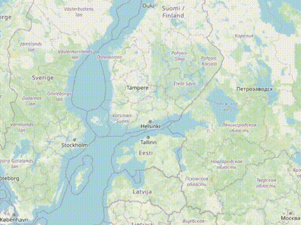

# egui-map-view

[](https://crates.io/crates/egui-map-view)
[](https://docs.rs/egui-map-view)

A simple, interactive map view widget for `egui`.



`egui-map-view` provides a pannable, zoomable map widget that fetches and displays tiles from a configurable tile server, making it easy to integrate interactive maps into your `egui` applications.

(Like it is the way of the times we live in Gemini codeassist LLM has been used in places to rework parts of the code and to bring more features to the codebase.)

## Features

* **Interactive Navigation**: Pan by dragging, zoom with the mouse wheel or center and zoom with double-clicking.
* **Asynchronous Tile Fetching**: Tiles are downloaded in the background without blocking the UI, with support for `poll_promise`.
* **Customizable Tile Providers**: Use any tile server that follows the standard `z/x/y` scheme. Comes with a pre-configured provider for OpenStreetMap and National Land Survey of Finland for which you need an API key to use.
* **Coordinate Display**: Exposes the geographical coordinates (latitude, longitude) under the mouse cursor.
* **Robust Placeholders**: Displays placeholders for tiles that are loading or have failed to download, with error details available on hover.
* **Attribution**: Displays the map data's attribution with optional link to the provider's website.
* **Robust layering system**: Add layers to the map that can display additional data on top of the base map.

## Usage

First, add `egui-map-view` to your `Cargo.toml`:

```toml
[dependencies]
egui-map-view = "0.2.0" # Replace with the latest version
```

Then, create a `Map` widget and add it to your `egui` UI.

```rust
use eframe::egui;
use egui_map::{Map, config::OpenStreetMapConfig};

struct MyApp {
    map: Map,
}

impl Default for MyApp {
    fn default() -> Self {
        Self {
            // Create a new map with the default OpenStreetMap provider.
            map: Map::new(OpenStreetMapConfig::default()),
        }
    }
}

impl eframe::App for MyApp {
    fn update(&mut self, ctx: &egui::Context, _frame: &mut eframe::Frame) {
        egui::CentralPanel::default()
            .frame(egui::Frame::NONE)
            .show(ctx, |ui| {
                // Add the map widget to the UI.
                ui.add(&mut self.map);
            });

        // A window to show map information and controls.
        egui::Window::new("Map Info").show(ctx, |ui| {
            ui.label(format!("Zoom: {}", self.map.zoom));
            ui.label(format!("Center: {:.4}, {:.4}", self.map.center.1, self.map.center.0));
            
            ui.separator();

            if let Some((lon, lat)) = self.map.mouse_pos {
                ui.label(format!("Mouse: {:.4}, {:.4}", lat, lon));
            } else {
                ui.label("Mouse: N/A");
            }
        });
    }
}
```

## Configuration

The map's appearance and behavior are controlled by a type that implements the `MapConfig` trait. This trait defines the tile server URL, attribution, and default view settings.

`egui-map` comes with `OpenStreetMapConfig` for the standard OpenStreetMap tile server.

### Using a Custom Tile Provider

You can implement the `MapConfig` trait to use any other tile server. For example, here's how you could create a configuration for a custom provider:

```rust
use egui_map::config::MapConfig;
use egui_map::TileId;

struct MyCustomProvider {
    // ... any fields your provider needs, like an API key.
}

impl MapConfig for MyCustomProvider {
    fn tile_url(&self, tile_id: &TileId) -> String {
        // Construct the URL for your tile server.
        format!("https://my-tile-server.com/{}/{}/{}.png", tile_id.z, tile_id.x, tile_id.y)
    }

    fn attribution(&self) -> &str {
        // Return the attribution string required by your provider.
        "My Custom Tiles © Me"
    }

    // You can also override default_center() and default_zoom().
}

// Then, create the map with your custom provider.
let my_map = Map::new(MyCustomProvider { /* ... */ });
```

## Contributing

Contributions are welcome! Feel free to open an issue or submit a pull request if you have any ideas for improvements.

## License

This project is licensed under the MIT License. See the `LICENSE` file for details.
